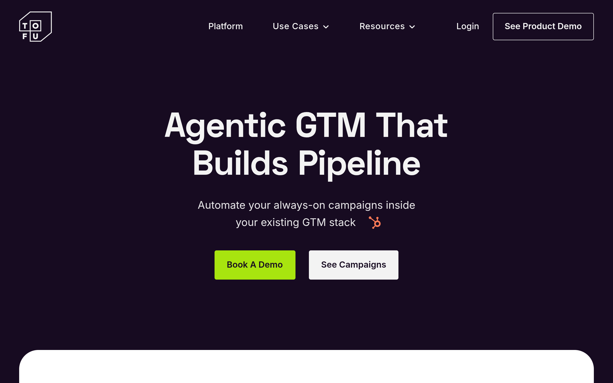

# tofuhq Design System

You are building UI for **tofuhq**. Light-themed, cool palette, sans-serif typography (webflow-icons), compact density on a 4px grid, expressive motion.

## Visual Reference

**IMPORTANT**: Study ALL screenshots below before writing any UI. Match colors, typography, spacing, layout, and motion exactly as shown.

### Homepage



> Read `references/DESIGN.md` for full token details.

## Design Philosophy

- **Layered depth** — use shadow tokens to create a sense of physical layering. Each elevation level has a specific shadow.
- **Gradient accents** — gradients are used thoughtfully for emphasis, not decoration.
- **Type pairing** — webflow-icons for body/UI text, swiper-icons for headings/display. Never introduce a third typeface.
- **compact density** — 4px base grid. Every dimension is a multiple of 4.
- **cool palette** — the color temperature runs cool, matching the sans-serif typography.
- **Restrained accent** — `#007aff` is the only pop of color. Used exclusively for CTAs, links, focus rings, and active states.
- **Expressive motion** — animations are an integral part of the experience. Use spring physics and layout animations.

## Color System

### Core Palette

| Role | Token | Hex | Use |
|------|-------|-----|-----|
| Background | `--background` | `#ffffff` | Page/app background |
| Text Primary | `--text-primary` | `#170b21` | Headings, body text |
| Text Muted | `--text-muted` | `#eeeeee` | Captions, placeholders |
| Accent | `--accent` | `#007aff` | CTAs, links, focus rings |
| Border | `--border` | `#222222` | Dividers, card borders |

### Status Colors

| Status | Hex | Use |
|--------|-----|-----|
| Danger | `#ffdede` | Errors, destructive actions |

### Extended Palette

- **swiper-preloader-color:** `#000000` — Deep background layer or shadow color
- `#dddddd`
- `#c5f058`
- `#333333`
- `#a8e40f`
- `#3898ec`
- `#bd41f0`
- `#999999`

### CSS Variable Tokens

```css
--green-secondary: #84cc16;
--secondary--green6: #f3ffd6;
--secondary--purple6: #e9ddff;
--secondary--green4: #bbc5a4;
--secondary--green1: #3b5500;
--secondary--purple4: #d4bdff;
--secondary--purple1: #3e1e7a;
--secondary--green5: #e5f4c1;
--secondary--purple5: #dcccff;
--secondary--green2: #a6ca50;
--secondary--purple2: #9d88c7;
--bg-color-secondary: #f5f8f1;
--secondary--green3: #e0ff92;
--secondary--purple3: #c4a5ff;
--green-secondary: #84cc16;
--secondary--green6: #f3ffd6;
--secondary--purple6: #e9ddff;
--secondary--green4: #bbc5a4;
--secondary--green1: #3b5500;
--secondary--purple4: #d4bdff;
```

## Typography

### Font Stack

- **webflow-icons** — Heading 1, Heading 2, Heading 3
- **swiper-icons** — Body, Caption

### Font Sources

```css
@font-face {
  font-family: "Space Grotesk Bold";
  src: url("fonts/SpaceGroteskBold-700.ttf") format("truetype");
  font-weight: 700;
}
@font-face {
  font-family: "swiper-icons";
  src: url("data:application/font-woff;charset=utf-8;base64, d09GRgABAAAAAAZgABAAAAAADAAAAAAAAAAAAAAAAAAAAAAAAAAAAAAAAABGRlRNAAAGRAAAABoAAAAci6qHkUdERUYAAAWgAAAAIwAAACQAYABXR1BPUwAABhQAAAAuAAAANuAY7+xHU1VCAAAFxAAAAFAAAABm2fPczU9TLzIAAAHcAAAASgAAAGBP9V5RY21hcAAAAkQAAACIAAABYt6F0cBjdnQgAAACzAAAAAQAAAAEABEBRGdhc3AAAAWYAAAACAAAAAj//wADZ2x5ZgAAAywAAADMAAAD2MHtryVoZWFkAAABbAAAADAAAAA2E2+eoWhoZWEAAAGcAAAAHwAAACQC9gDzaG10eAAAAigAAAAZAAAArgJkABFsb2NhAAAC0AAAAFoAAABaFQAUGG1heHAAAAG8AAAAHwAAACAAcABAbmFtZQAAA/gAAAE5AAACXvFdBwlwb3N0AAAFNAAAAGIAAACE5s74hXjaY2BkYGAAYpf5Hu/j+W2+MnAzMYDAzaX6QjD6/4//Bxj5GA8AuRwMYGkAPywL13jaY2BkYGA88P8Agx4j+/8fQDYfA1AEBWgDAIB2BOoAeNpjYGRgYNBh4GdgYgABEMnIABJzYNADCQAACWgAsQB42mNgYfzCOIGBlYGB0YcxjYGBwR1Kf2WQZGhhYGBiYGVmgAFGBiQQkOaawtDAoMBQxXjg/wEGPcYDDA4wNUA2CCgwsAAAO4EL6gAAeNpj2M0gyAACqxgGNWBkZ2D4/wMA+xkDdgAAAHjaY2BgYGaAYBkGRgYQiAHyGMF8FgYHIM3DwMHABGQrMOgyWDLEM1T9/w8UBfEMgLzE////P/5//f/V/xv+r4eaAAeMbAxwIUYmIMHEgKYAYjUcsDAwsLKxc3BycfPw8jEQA/gZBASFhEVExcQlJKWkZWTl5BUUlZRVVNXUNTQZBgMAAMR+E+gAEQFEAAAAKgAqACoANAA+AEgAUgBcAGYAcAB6AIQAjgCYAKIArAC2AMAAygDUAN4A6ADyAPwBBgEQARoBJAEuATgBQgFMAVYBYAFqAXQBfgGIAZIBnAGmAbIBzgHsAAB42u2NMQ6CUAyGW568x9AneYYgm4MJbhKFaExIOAVX8ApewSt4Bic4AfeAid3VOBixDxfPYEza5O+Xfi04YADggiUIULCuEJK8VhO4bSvpdnktHI5QCYtdi2sl8ZnXaHlqUrNKzdKcT8cjlq+rwZSvIVczNiezsfnP/uznmfPFBNODM2K7MTQ45YEAZqGP81AmGGcF3iPqOop0r1SPTaTbVkfUe4HXj97wYE+yNwWYxwWu4v1ugWHgo3S1XdZEVqWM7ET0cfnLGxWfkgR42o2PvWrDMBSFj/IHLaF0zKjRgdiVMwScNRAoWUoH78Y2icB/yIY09An6AH2Bdu/UB+yxopYshQiEvnvu0dURgDt8QeC8PDw7Fpji3fEA4z/PEJ6YOB5hKh4dj3EvXhxPqH/SKUY3rJ7srZ4FZnh1PMAtPhwP6fl2PMJMPDgeQ4rY8YT6Gzao0eAEA409DuggmTnFnOcSCiEiLMgxCiTI6Cq5DZUd3Qmp10vO0LaLTd2cjN4fOumlc7lUYbSQcZFkutRG7g6JKZKy0RmdLY680CDnEJ+UMkpFFe1RN7nxdVpXrC4aTtnaurOnYercZg2YVmLN/d/gczfEimrE/fs/bOuq29Zmn8tloORaXgZgGa78yO9/cnXm2BpaGvq25Dv9S4E9+5SIc9PqupJKhYFSSl47+Qcr1mYNAAAAeNptw0cKwkAAAMDZJA8Q7OUJvkLsPfZ6zFVERPy8qHh2YER+3i/BP83vIBLLySsoKimrqKqpa2hp6+jq6RsYGhmbmJqZSy0sraxtbO3sHRydnEMU4uR6yx7JJXveP7WrDycAAAAAAAH//wACeNpjYGRgYOABYhkgZgJCZgZNBkYGLQZtIJsFLMYAAAw3ALgAeNolizEKgDAQBCchRbC2sFER0YD6qVQiBCv/H9ezGI6Z5XBAw8CBK/m5iQQVauVbXLnOrMZv2oLdKFa8Pjuru2hJzGabmOSLzNMzvutpB3N42mNgZGBg4GKQYzBhYMxJLMlj4GBgAYow/P/PAJJhLM6sSoWKfWCAAwDAjgbRAAB42mNgYGBkAIIbCZo5IPrmUn0hGA0AO8EFTQAA");
  font-weight: 400;
}
@font-face {
  font-family: "webflow-icons";
  src: url("data:application/x-font-ttf;charset=utf-8;base64,AAEAAAALAIAAAwAwT1MvMg8SBiUAAAC8AAAAYGNtYXDpP+a4AAABHAAAAFxnYXNwAAAAEAAAAXgAAAAIZ2x5ZmhS2XEAAAGAAAADHGhlYWQTFw3HAAAEnAAAADZoaGVhCXYFgQAABNQAAAAkaG10eCe4A1oAAAT4AAAAMGxvY2EDtALGAAAFKAAAABptYXhwABAAPgAABUQAAAAgbmFtZSoCsMsAAAVkAAABznBvc3QAAwAAAAAHNAAAACAAAwP4AZAABQAAApkCzAAAAI8CmQLMAAAB6wAzAQkAAAAAAAAAAAAAAAAAAAABEAAAAAAAAAAAAAAAAAAAAABAAADpAwPA/8AAQAPAAEAAAAABAAAAAAAAAAAAAAAgAAAAAAADAAAAAwAAABwAAQADAAAAHAADAAEAAAAcAAQAQAAAAAwACAACAAQAAQAg5gPpA//9//8AAAAAACDmAOkA//3//wAB/+MaBBcIAAMAAQAAAAAAAAAAAAAAAAABAAH//wAPAAEAAAAAAAAAAAACAAA3OQEAAAAAAQAAAAAAAAAAAAIAADc5AQAAAAABAAAAAAAAAAAAAgAANzkBAAAAAAEBIAAAAyADgAAFAAAJAQcJARcDIP5AQAGA/oBAAcABwED+gP6AQAABAOAAAALgA4AABQAAEwEXCQEH4AHAQP6AAYBAAcABwED+gP6AQAAAAwDAAOADQALAAA8AHwAvAAABISIGHQEUFjMhMjY9ATQmByEiBh0BFBYzITI2PQE0JgchIgYdARQWMyEyNj0BNCYDIP3ADRMTDQJADRMTDf3ADRMTDQJADRMTDf3ADRMTDQJADRMTAsATDSANExMNIA0TwBMNIA0TEw0gDRPAEw0gDRMTDSANEwAAAAABAJ0AtAOBApUABQAACQIHCQEDJP7r/upcAXEBcgKU/usBFVz+fAGEAAAAAAL//f+9BAMDwwAEAAkAABcBJwEXAwE3AQdpA5ps/GZsbAOabPxmbEMDmmz8ZmwDmvxmbAOabAAAAgAA/8AEAAPAAB0AOwAABSInLgEnJjU0Nz4BNzYzMTIXHgEXFhUUBw4BBwYjNTI3PgE3NjU0Jy4BJyYjMSIHDgEHBhUUFx4BFxYzAgBqXV6LKCgoKIteXWpqXV6LKCgoKIteXWpVSktvICEhIG9LSlVVSktvICEhIG9LSlVAKCiLXl1qal1eiygoKCiLXl1qal1eiygoZiEgb0tKVVVKS28gISEgb0tKVVVKS28gIQABAAABwAIAA8AAEgAAEzQ3PgE3NjMxFSIHDgEHBhUxIwAoKIteXWpVSktvICFmAcBqXV6LKChmISBvS0pVAAAAAgAA/8AFtgPAADIAOgAAARYXHgEXFhUUBw4BBwYHIxUhIicuAScmNTQ3PgE3NjMxOAExNDc+ATc2MzIXHgEXFhcVATMJATMVMzUEjD83NlAXFxYXTjU1PQL8kz01Nk8XFxcXTzY1PSIjd1BQWlJJSXInJw3+mdv+2/7c25MCUQYcHFg5OUA/ODlXHBwIAhcXTzY1PTw1Nk8XF1tQUHcjIhwcYUNDTgL+3QFt/pOTkwABAAAAAQAAmM7nP18PPPUACwQAAAAAANciZKUAAAAA1yJkpf/9/70FtgPDAAAACAACAAAAAAAAAAEAAAPA/8AAAAW3//3//QW2AAEAAAAAAAAAAAAAAAAAAAAMBAAAAAAAAAAAAAAAAgAAAAQAASAEAADgBAAAwAQAAJ0EAP/9BAAAAAQAAAAFtwAAAAAAAAAKABQAHgAyAEYAjACiAL4BFgE2AY4AAAABAAAADAA8AAMAAAAAAAIAAAAAAAAAAAAAAAAAAAAAAAAADgCuAAEAAAAAAAEADQAAAAEAAAAAAAIABwCWAAEAAAAAAAMADQBIAAEAAAAAAAQADQCrAAEAAAAAAAUACwAnAAEAAAAAAAYADQBvAAEAAAAAAAoAGgDSAAMAAQQJAAEAGgANAAMAAQQJAAIADgCdAAMAAQQJAAMAGgBVAAMAAQQJAAQAGgC4AAMAAQQJAAUAFgAyAAMAAQQJAAYAGgB8AAMAAQQJAAoANADsd2ViZmxvdy1pY29ucwB3AGUAYgBmAGwAbwB3AC0AaQBjAG8AbgBzVmVyc2lvbiAxLjAAVgBlAHIAcwBpAG8AbgAgADEALgAwd2ViZmxvdy1pY29ucwB3AGUAYgBmAGwAbwB3AC0AaQBjAG8AbgBzd2ViZmxvdy1pY29ucwB3AGUAYgBmAGwAbwB3AC0AaQBjAG8AbgBzUmVndWxhcgBSAGUAZwB1AGwAYQByd2ViZmxvdy1pY29ucwB3AGUAYgBmAGwAbwB3AC0AaQBjAG8AbgBzRm9udCBnZW5lcmF0ZWQgYnkgSWNvTW9vbi4ARgBvAG4AdAAgAGcAZQBuAGUAcgBhAHQAZQBkACAAYgB5ACAASQBjAG8ATQBvAG8AbgAuAAAAAwAAAAAAAAAAAAAAAAAAAAAAAAAAAAAAAAAAAAAAAA==") format("truetype");
  font-weight: 400;
}
```

### Type Scale

| Role | Family | Size | Weight |
|------|--------|------|--------|
| Heading 1 | webflow-icons | 160px | 700 |
| Heading 2 | webflow-icons | 120px | 700 |
| Heading 3 | webflow-icons | 100px | 700 |
| Body | swiper-icons | 18px | 400 |
| Caption | swiper-icons | 14px | 400 |

### Typography Rules

- Body/UI: **webflow-icons**, Headings: **swiper-icons** — these are the only display fonts
- Max 3-4 font sizes per screen
- Headings: weight 600-700, body: weight 400
- Use color and opacity for text hierarchy, not additional font sizes
- Line height: 1.5 for body, 1.2 for headings

## Spacing & Layout

### Base Grid: 4px

Every dimension (margin, padding, gap, width, height) must be a multiple of **4px**.

### Spacing Scale

`2, 4, 6, 8, 10, 12, 14, 16, 18, 20, 22, 24` px

### Spacing as Meaning

| Spacing | Use |
|---------|-----|
| 4-8px | Tight: related items (icon + label, avatar + name) |
| 12-16px | Medium: between groups within a section |
| 24-32px | Wide: between distinct sections |
| 48px+ | Vast: major page section breaks |

### Border Radius

Scale: `unset, .125rem, .25rem, 1rem, 1.25rem, 2px, 3px, 4px, 5px, 6px, 7px, 8px, 9px, 10px, 11.55px, 12px, 14px, 15px, 16px, 20px, 21.93px, 24px, 40px, 50px, 100%, 100px`
Default: `10px`

### Container

Max-width: `991px`, centered with auto margins.

### Breakpoints

| Name | Value |
|------|-------|
| xs | 479px |
| xs | 480px |
| md | 767px |
| md | 768px |
| lg | 991px |
| lg | 992px |
| xl | 1280px |
| 2xl | 1440px |
| 2xl | 1920px |

Mobile-first: design for small screens, layer on responsive overrides.

## Component Patterns

### Card

```css
.card {
  background: #ffffff;
  border: 1px solid #222222;
  border-radius: 10px;
  padding: 16px;
  box-shadow: unset;
}
```

```html
<div class="card">
  <h3>Card Title</h3>
  <p>Card content goes here.</p>
</div>
```

### Button

```css
/* Primary */
.btn-primary {
  background: #007aff;
  color: #170b21;
  border-radius: 10px;
  padding: 8px 16px;
  font-weight: 500;
  transition: opacity 150ms ease;
}
.btn-primary:hover { opacity: 0.9; }

/* Ghost */
.btn-ghost {
  background: transparent;
  border: 1px solid #222222;
  color: #170b21;
  border-radius: 10px;
  padding: 8px 16px;
}
```

```html
<button class="btn-primary">Get Started</button>
<button class="btn-ghost">Learn More</button>
```

### Input

```css
.input {
  background: #ffffff;
  border: 1px solid #222222;
  border-radius: 10px;
  padding: 8px 12px;
  color: #170b21;
  font-size: 14px;
}
.input:focus { border-color: #007aff; outline: none; }
```

```html
<input class="input" type="text" placeholder="Search..." />
```

### Badge / Chip

```css
.badge {
  display: inline-flex;
  align-items: center;
  padding: 4px 8px;
  border-radius: 9999px;
  font-size: 12px;
  font-weight: 500;
  background: #ffffff;
  color: #eeeeee;
}
```

```html
<span class="badge">New</span>
<span class="badge">Beta</span>
```

### Modal / Dialog

```css
.modal-backdrop { background: rgba(0, 0, 0, 0.6); }
.modal {
  background: #ffffff;
  border: 1px solid #222222;
  border-radius: 100px;
  padding: 24px;
  max-width: 480px;
  width: 90vw;
  box-shadow: 0 5px 20px #0000001a;
}
```

```html
<div class="modal-backdrop">
  <div class="modal">
    <h2>Dialog Title</h2>
    <p>Dialog content.</p>
    <button class="btn-primary">Confirm</button>
    <button class="btn-ghost">Cancel</button>
  </div>
</div>
```

### Table

```css
.table { width: 100%; border-collapse: collapse; }
.table th {
  text-align: left;
  padding: 8px 12px;
  font-weight: 500;
  font-size: 12px;
  color: #eeeeee;
  text-transform: uppercase;
  letter-spacing: 0.05em;
  border-bottom: 1px solid #222222;
}
.table td {
  padding: 12px;
  border-bottom: 1px solid #222222;
}
```

```html
<table class="table">
  <thead><tr><th>Name</th><th>Status</th><th>Date</th></tr></thead>
  <tbody>
    <tr><td>Item One</td><td>Active</td><td>Jan 1</td></tr>
    <tr><td>Item Two</td><td>Pending</td><td>Jan 2</td></tr>
  </tbody>
</table>
```

### Navigation

```css
.nav {
  display: flex;
  align-items: center;
  gap: 8px;
  padding: 12px 16px;
  border-bottom: 1px solid #222222;
}
.nav-link {
  color: #eeeeee;
  padding: 8px 12px;
  border-radius: 10px;
  transition: color 150ms;
}
.nav-link:hover { color: #170b21; }
.nav-link.active { color: #007aff; }
```

```html
<nav class="nav">
  <a href="/" class="nav-link active">Home</a>
  <a href="/about" class="nav-link">About</a>
  <a href="/pricing" class="nav-link">Pricing</a>
  <button class="btn-primary" style="margin-left: auto">Get Started</button>
</nav>
```

### Extracted Components

These components were found in the codebase:

**Card** (`html`)
- Variants: `item`

## Page Structure

The following page sections were detected:

- **Navigation** — Top navigation bar (16 items)
- **Hero** — Hero/banner section with headline and CTAs
- **Footer** — Page footer with links and info (20 items)
- **Testimonials** — Testimonials/reviews section
- **Cards** — Grid of 14 card elements (14 items)
- **Cta** — Call-to-action section

When building pages, follow this section order and structure.

## Animation & Motion

This project uses **expressive motion**. Animations are part of the design language.

### CSS Animations

- `swiper-preloader-spin`
- `spin`
- `slide`
- `grow`
- `scroll`

### Motion Tokens

- **Duration scale:** `100ms`, `150ms`, `200ms`, `250ms`, `300ms`, `350ms`, `400ms`, `500ms`
- **Easing functions:** `ease-out`, `cubic-bezier(.47,0,.745,.715)`, `ease-in-out`, `ease`

### Motion Guidelines

- **Duration:** Use values from the duration scale above. Short (100ms) for micro-interactions, long (500ms) for page transitions
- **Easing:** Use `ease-out` as the default easing curve
- **Direction:** Elements enter from bottom/right, exit to top/left
- **Reduced motion:** Always respect `prefers-reduced-motion` — disable animations when set

## Depth & Elevation

### Shadow Tokens

- Subtle: `0 0 0 2px #fff`
- Raised (cards, buttons): `unset`
- Raised (cards, buttons): `0 0 0 1px #0000001a,0 1px 3px #0000001a`
- Raised (cards, buttons): `0 0 3px #3336`
- Raised (cards, buttons): `0 0 3px 1px #3898ec`
- Raised (cards, buttons): `0 0 1rem #1d4ed800`

### Z-Index Scale

`0, 1, 2, 3, 4, 5, 10, 15, 20, 25, 50, 60, 99, 100, 200, 900, 998, 999, 1000, 1001, 1050, 2000, 9999, 99999, 9999999, 2147483647`

Use these exact values — never invent z-index values.

## Anti-Patterns (Never Do)

- **No blur effects** — no backdrop-blur, no filter: blur()
- **No zebra striping** — tables and lists use borders for separation
- **No invented colors** — every hex value must come from the palette above
- **No arbitrary spacing** — every dimension is a multiple of 4px
- **No extra fonts** — only webflow-icons and swiper-icons are allowed
- **No arbitrary border-radius** — use the scale: .125rem, .25rem, 1rem, 1.25rem, 2px, 3px, 4px, 5px, 6px, 7px
- **No opacity for disabled states** — use muted colors instead

## Workflow

1. **Read** `references/DESIGN.md` before writing any UI code
2. **Pick colors** from the Color System section — never invent new ones
3. **Set typography** — webflow-icons, swiper-icons only, using the type scale
4. **Build layout** on the 4px grid — check every margin, padding, gap
5. **Match components** to patterns above before creating new ones
6. **Apply elevation** — use shadow tokens
7. **Validate** — every value traces back to a design token. No magic numbers.

## Brand Spec

- **Favicon:** `https://cdn.prod.website-files.com/64fa0ab7e6a23c8805104b2b/652868104284eb3856d4e91d_Tofu%20Fav%20Icon.png`
- **Site URL:** `https://www.tofuhq.com/`
- **Brand color:** `#007aff`
- **Brand typeface:** webflow-icons

## Quick Reference

```
Background:     #ffffff
Surface:        (not extracted)
Text:           #170b21 / #eeeeee
Accent:         #007aff
Border:         #222222
Font:           webflow-icons
Spacing:        4px grid
Radius:         10px
Components:     9 detected
```

## When to Trigger

Activate this skill when:
- Creating new components, pages, or visual elements for tofuhq
- Writing CSS, Tailwind classes, styled-components, or inline styles
- Building page layouts, templates, or responsive designs
- Reviewing UI code for design consistency
- The user mentions "tofuhq" design, style, UI, or theme
- Generating mockups, wireframes, or visual prototypes

---

# Full Reference Files

> Every output file is embedded below. Claude has full design system context from /skills alone.

## Design System Tokens (DESIGN.md)

# tofuhq DESIGN.md

> Auto-generated design system — reverse-engineered via static analysis by skillui.
> Frameworks: None detected
> Colors: 20 · Fonts: 2 · Components: 9
> Icon library: not detected · State: not detected
> Primary theme: light · Dark mode toggle: no · Motion: expressive

## Visual Reference

**Match this design exactly** — study colors, fonts, spacing, and component shapes before writing any UI code.


---

## 1. Visual Theme & Atmosphere

This is a **light-themed** interface with a cool, approachable feel. The light background emphasizes content clarity. Typography pairs **swiper-icons** for display/headings with **webflow-icons** for body text, creating clear visual hierarchy through type contrast. Spacing follows a **4px base grid** (compact density), with scale: 2, 4, 6, 8, 10, 12, 14, 16px. The palette is predominantly monochromatic with **#007aff** as the single accent color — used sparingly for interactive elements and emphasis. Motion is expressive — spring physics, layout animations, and staggered reveals are part of the visual language.

---

## 2. Color Palette & Roles

| Token | Hex | Role | Use |
|---|---|---|---|
| swiper-preloader-color | `#ffffff` | background | Page background, darkest surface |
| text-primary | `#170b21` | text-primary | Headings and body text |
| bg-color-secondary | `#eeeeee` | text-muted | Captions, placeholders, secondary info |
| text-muted | `#758696` | text-muted | Captions, placeholders, secondary info |
| border | `#222222` | border | Dividers, card borders, outlines |
| swiper-theme-color | `#007aff` | accent | CTAs, links, focus rings, active states |
| danger | `#ffdede` | danger | Error states, destructive actions |
| info | `#3898ec` | info | Informational highlights |
| swiper-preloader-color | `#000000` | unknown | Palette color |
| unknown | `#dddddd` | unknown | Palette color |
| unknown | `#c5f058` | unknown | Palette color |
| unknown | `#333333` | unknown | Palette color |
| unknown | `#a8e40f` | unknown | Palette color |
| unknown | `#bd41f0` | unknown | Palette color |
| unknown | `#999999` | unknown | Palette color |
| unknown | `#c8c8c8` | unknown | Palette color |
| unknown | `#1d4ed8` | unknown | Palette color |
| unknown | `#5d6c7b` | unknown | Palette color |
| bg-color | `#2c203a` | unknown | Palette color |
| secondary--green6 | `#f3ffd6` | unknown | Palette color |

### CSS Variable Tokens

```css
--green-secondary: #84cc16;
--secondary--green6: #f3ffd6;
--secondary--purple6: #e9ddff;
--secondary--green4: #bbc5a4;
--secondary--green1: #3b5500;
--secondary--purple4: #d4bdff;
--secondary--purple1: #3e1e7a;
--secondary--green5: #e5f4c1;
--secondary--purple5: #dcccff;
--secondary--green2: #a6ca50;
--secondary--purple2: #9d88c7;
--bg-color-secondary: #f5f8f1;
--secondary--green3: #e0ff92;
--secondary--purple3: #c4a5ff;
--green-secondary: #84cc16;
--secondary--green6: #f3ffd6;
--secondary--purple6: #e9ddff;
--secondary--green4: #bbc5a4;
--secondary--green1: #3b5500;
--secondary--purple4: #d4bdff;
```


---

## 3. Typography Rules

**Font Stack:**
- **webflow-icons** — Heading 1, Heading 2, Heading 3
- **swiper-icons** — Body, Caption

**Font Sources:**

```css
@font-face {
  font-family: "Space Grotesk Bold";
  src: url("fonts/SpaceGroteskBold-700.ttf") format("truetype");
  font-weight: 700;
}
@font-face {
  font-family: "swiper-icons";
  src: url("data:application/font-woff;charset=utf-8;base64, d09GRgABAAAAAAZgABAAAAAADAAAAAAAAAAAAAAAAAAAAAAAAAAAAAAAAABGRlRNAAAGRAAAABoAAAAci6qHkUdERUYAAAWgAAAAIwAAACQAYABXR1BPUwAABhQAAAAuAAAANuAY7+xHU1VCAAAFxAAAAFAAAABm2fPczU9TLzIAAAHcAAAASgAAAGBP9V5RY21hcAAAAkQAAACIAAABYt6F0cBjdnQgAAACzAAAAAQAAAAEABEBRGdhc3AAAAWYAAAACAAAAAj//wADZ2x5ZgAAAywAAADMAAAD2MHtryVoZWFkAAABbAAAADAAAAA2E2+eoWhoZWEAAAGcAAAAHwAAACQC9gDzaG10eAAAAigAAAAZAAAArgJkABFsb2NhAAAC0AAAAFoAAABaFQAUGG1heHAAAAG8AAAAHwAAACAAcABAbmFtZQAAA/gAAAE5AAACXvFdBwlwb3N0AAAFNAAAAGIAAACE5s74hXjaY2BkYGAAYpf5Hu/j+W2+MnAzMYDAzaX6QjD6/4//Bxj5GA8AuRwMYGkAPywL13jaY2BkYGA88P8Agx4j+/8fQDYfA1AEBWgDAIB2BOoAeNpjYGRgYNBh4GdgYgABEMnIABJzYNADCQAACWgAsQB42mNgYfzCOIGBlYGB0YcxjYGBwR1Kf2WQZGhhYGBiYGVmgAFGBiQQkOaawtDAoMBQxXjg/wEGPcYDDA4wNUA2CCgwsAAAO4EL6gAAeNpj2M0gyAACqxgGNWBkZ2D4/wMA+xkDdgAAAHjaY2BgYGaAYBkGRgYQiAHyGMF8FgYHIM3DwMHABGQrMOgyWDLEM1T9/w8UBfEMgLzE////P/5//f/V/xv+r4eaAAeMbAxwIUYmIMHEgKYAYjUcsDAwsLKxc3BycfPw8jEQA/gZBASFhEVExcQlJKWkZWTl5BUUlZRVVNXUNTQZBgMAAMR+E+gAEQFEAAAAKgAqACoANAA+AEgAUgBcAGYAcAB6AIQAjgCYAKIArAC2AMAAygDUAN4A6ADyAPwBBgEQARoBJAEuATgBQgFMAVYBYAFqAXQBfgGIAZIBnAGmAbIBzgHsAAB42u2NMQ6CUAyGW568x9AneYYgm4MJbhKFaExIOAVX8ApewSt4Bic4AfeAid3VOBixDxfPYEza5O+Xfi04YADggiUIULCuEJK8VhO4bSvpdnktHI5QCYtdi2sl8ZnXaHlqUrNKzdKcT8cjlq+rwZSvIVczNiezsfnP/uznmfPFBNODM2K7MTQ45YEAZqGP81AmGGcF3iPqOop0r1SPTaTbVkfUe4HXj97wYE+yNwWYxwWu4v1ugWHgo3S1XdZEVqWM7ET0cfnLGxWfkgR42o2PvWrDMBSFj/IHLaF0zKjRgdiVMwScNRAoWUoH78Y2icB/yIY09An6AH2Bdu/UB+yxopYshQiEvnvu0dURgDt8QeC8PDw7Fpji3fEA4z/PEJ6YOB5hKh4dj3EvXhxPqH/SKUY3rJ7srZ4FZnh1PMAtPhwP6fl2PMJMPDgeQ4rY8YT6Gzao0eAEA409DuggmTnFnOcSCiEiLMgxCiTI6Cq5DZUd3Qmp10vO0LaLTd2cjN4fOumlc7lUYbSQcZFkutRG7g6JKZKy0RmdLY680CDnEJ+UMkpFFe1RN7nxdVpXrC4aTtnaurOnYercZg2YVmLN/d/gczfEimrE/fs/bOuq29Zmn8tloORaXgZgGa78yO9/cnXm2BpaGvq25Dv9S4E9+5SIc9PqupJKhYFSSl47+Qcr1mYNAAAAeNptw0cKwkAAAMDZJA8Q7OUJvkLsPfZ6zFVERPy8qHh2YER+3i/BP83vIBLLySsoKimrqKqpa2hp6+jq6RsYGhmbmJqZSy0sraxtbO3sHRydnEMU4uR6yx7JJXveP7WrDycAAAAAAAH//wACeNpjYGRgYOABYhkgZgJCZgZNBkYGLQZtIJsFLMYAAAw3ALgAeNolizEKgDAQBCchRbC2sFER0YD6qVQiBCv/H9ezGI6Z5XBAw8CBK/m5iQQVauVbXLnOrMZv2oLdKFa8Pjuru2hJzGabmOSLzNMzvutpB3N42mNgZGBg4GKQYzBhYMxJLMlj4GBgAYow/P/PAJJhLM6sSoWKfWCAAwDAjgbRAAB42mNgYGBkAIIbCZo5IPrmUn0hGA0AO8EFTQAA");
  font-weight: 400;
}
@font-face {
  font-family: "webflow-icons";
  src: url("data:application/x-font-ttf;charset=utf-8;base64,AAEAAAALAIAAAwAwT1MvMg8SBiUAAAC8AAAAYGNtYXDpP+a4AAABHAAAAFxnYXNwAAAAEAAAAXgAAAAIZ2x5ZmhS2XEAAAGAAAADHGhlYWQTFw3HAAAEnAAAADZoaGVhCXYFgQAABNQAAAAkaG10eCe4A1oAAAT4AAAAMGxvY2EDtALGAAAFKAAAABptYXhwABAAPgAABUQAAAAgbmFtZSoCsMsAAAVkAAABznBvc3QAAwAAAAAHNAAAACAAAwP4AZAABQAAApkCzAAAAI8CmQLMAAAB6wAzAQkAAAAAAAAAAAAAAAAAAAABEAAAAAAAAAAAAAAAAAAAAABAAADpAwPA/8AAQAPAAEAAAAABAAAAAAAAAAAAAAAgAAAAAAADAAAAAwAAABwAAQADAAAAHAADAAEAAAAcAAQAQAAAAAwACAACAAQAAQAg5gPpA//9//8AAAAAACDmAOkA//3//wAB/+MaBBcIAAMAAQAAAAAAAAAAAAAAAAABAAH//wAPAAEAAAAAAAAAAAACAAA3OQEAAAAAAQAAAAAAAAAAAAIAADc5AQAAAAABAAAAAAAAAAAAAgAANzkBAAAAAAEBIAAAAyADgAAFAAAJAQcJARcDIP5AQAGA/oBAAcABwED+gP6AQAABAOAAAALgA4AABQAAEwEXCQEH4AHAQP6AAYBAAcABwED+gP6AQAAAAwDAAOADQALAAA8AHwAvAAABISIGHQEUFjMhMjY9ATQmByEiBh0BFBYzITI2PQE0JgchIgYdARQWMyEyNj0BNCYDIP3ADRMTDQJADRMTDf3ADRMTDQJADRMTDf3ADRMTDQJADRMTAsATDSANExMNIA0TwBMNIA0TEw0gDRPAEw0gDRMTDSANEwAAAAABAJ0AtAOBApUABQAACQIHCQEDJP7r/upcAXEBcgKU/usBFVz+fAGEAAAAAAL//f+9BAMDwwAEAAkAABcBJwEXAwE3AQdpA5ps/GZsbAOabPxmbEMDmmz8ZmwDmvxmbAOabAAAAgAA/8AEAAPAAB0AOwAABSInLgEnJjU0Nz4BNzYzMTIXHgEXFhUUBw4BBwYjNTI3PgE3NjU0Jy4BJyYjMSIHDgEHBhUUFx4BFxYzAgBqXV6LKCgoKIteXWpqXV6LKCgoKIteXWpVSktvICEhIG9LSlVVSktvICEhIG9LSlVAKCiLXl1qal1eiygoKCiLXl1qal1eiygoZiEgb0tKVVVKS28gISEgb0tKVVVKS28gIQABAAABwAIAA8AAEgAAEzQ3PgE3NjMxFSIHDgEHBhUxIwAoKIteXWpVSktvICFmAcBqXV6LKChmISBvS0pVAAAAAgAA/8AFtgPAADIAOgAAARYXHgEXFhUUBw4BBwYHIxUhIicuAScmNTQ3PgE3NjMxOAExNDc+ATc2MzIXHgEXFhcVATMJATMVMzUEjD83NlAXFxYXTjU1PQL8kz01Nk8XFxcXTzY1PSIjd1BQWlJJSXInJw3+mdv+2/7c25MCUQYcHFg5OUA/ODlXHBwIAhcXTzY1PTw1Nk8XF1tQUHcjIhwcYUNDTgL+3QFt/pOTkwABAAAAAQAAmM7nP18PPPUACwQAAAAAANciZKUAAAAA1yJkpf/9/70FtgPDAAAACAACAAAAAAAAAAEAAAPA/8AAAAW3//3//QW2AAEAAAAAAAAAAAAAAAAAAAAMBAAAAAAAAAAAAAAAAgAAAAQAASAEAADgBAAAwAQAAJ0EAP/9BAAAAAQAAAAFtwAAAAAAAAAKABQAHgAyAEYAjACiAL4BFgE2AY4AAAABAAAADAA8AAMAAAAAAAIAAAAAAAAAAAAAAAAAAAAAAAAADgCuAAEAAAAAAAEADQAAAAEAAAAAAAIABwCWAAEAAAAAAAMADQBIAAEAAAAAAAQADQCrAAEAAAAAAAUACwAnAAEAAAAAAAYADQBvAAEAAAAAAAoAGgDSAAMAAQQJAAEAGgANAAMAAQQJAAIADgCdAAMAAQQJAAMAGgBVAAMAAQQJAAQAGgC4AAMAAQQJAAUAFgAyAAMAAQQJAAYAGgB8AAMAAQQJAAoANADsd2ViZmxvdy1pY29ucwB3AGUAYgBmAGwAbwB3AC0AaQBjAG8AbgBzVmVyc2lvbiAxLjAAVgBlAHIAcwBpAG8AbgAgADEALgAwd2ViZmxvdy1pY29ucwB3AGUAYgBmAGwAbwB3AC0AaQBjAG8AbgBzd2ViZmxvdy1pY29ucwB3AGUAYgBmAGwAbwB3AC0AaQBjAG8AbgBzUmVndWxhcgBSAGUAZwB1AGwAYQByd2ViZmxvdy1pY29ucwB3AGUAYgBmAGwAbwB3AC0AaQBjAG8AbgBzRm9udCBnZW5lcmF0ZWQgYnkgSWNvTW9vbi4ARgBvAG4AdAAgAGcAZQBuAGUAcgBhAHQAZQBkACAAYgB5ACAASQBjAG8ATQBvAG8AbgAuAAAAAwAAAAAAAAAAAAAAAAAAAAAAAAAAAAAAAAAAAAAAAA==") format("truetype");
  font-weight: 400;
}
```

| Role | Font | Size | Weight |
|---|---|---|---|
| Heading 1 | webflow-icons | 160px | 700 |
| Heading 2 | webflow-icons | 120px | 700 |
| Heading 3 | webflow-icons | 100px | 700 |
| Body | swiper-icons | 18px | 400 |
| Caption | swiper-icons | 14px | 400 |

**Typographic Rules:**
- Limit to 2 font families max per screen
- Use **webflow-icons** for body/UI text, **swiper-icons** for display/headings
- Maintain consistent hierarchy: no more than 3-4 font sizes per screen
- Headings use bold (600-700), body uses regular (400)
- Line height: 1.5 for body text, 1.2 for headings
- Use color and opacity for secondary hierarchy, not additional font sizes


---

## 4. Component Stylings

### Layout (1)

**Footer** — `html`

### Navigation (1)

**Navigation** — `html`

### Data Display (3)

**Card** — `html`
- Variants: `item`

**Badge** — `html`

**List** — `html`

### Data Input (1)

**Button** — `html`
- Animation: 

### Overlay (1)

**Modal** — `html`

### Media (2)

**Image** — `html`

**Icon** — `html`


---

## 5. Layout Principles

- **Base spacing unit:** 4px
- **Spacing scale:** 2, 4, 6, 8, 10, 12, 14, 16, 18, 20, 22, 24
- **Border radius:** unset, .125rem, .25rem, 1rem, 1.25rem, 2px, 3px, 4px, 5px, 6px, 7px, 8px, 9px, 10px, 11.55px, 12px, 14px, 15px, 16px, 20px, 21.93px, 24px, 40px, 50px, 100%, 100px
- **Max content width:** 991px

**Spacing as Meaning:**
| Spacing | Use |
|---|---|
| 4-8px | Tight: related items within a group |
| 12-16px | Medium: between groups |
| 24-32px | Wide: between sections |
| 48px+ | Vast: major section breaks |


---

## 6. Depth & Elevation

### Flat — subtle depth hints

- `0 0 0 2px #fff`

### Raised — cards, buttons, interactive elements

- `unset`
- `0 0 0 1px #0000001a,0 1px 3px #0000001a`
- `0 0 3px #3336`

### Floating — dropdowns, popovers, modals

- `0 5px 20px #0000001a`
- `0 4px 10px #0003`
- `-3px -4px 12px 1px #a8e40f40,6px 4px 12px 1px #a8e40f40,0-2px 12px 1px #a8e40f40`

### Overlay — full-screen overlays, top-level dialogs

- `0 10px 60px #00000040`

### Z-Index Scale

`0, 1, 2, 3, 4, 5, 10, 15, 20, 25, 50, 60, 99, 100, 200, 900, 998, 999, 1000, 1001, 1050, 2000, 9999, 99999, 9999999, 2147483647`


---

## 7. Animation & Motion

This project uses **expressive motion**. Animations are an integral part of the experience.

### CSS Animations

- `@keyframes swiper-preloader-spin`
- `@keyframes spin`
- `@keyframes slide`
- `@keyframes grow`
- `@keyframes scroll`

### Animated Components

- **Button**: 

### Motion Guidelines

- Duration: 150-300ms for micro-interactions, 300-500ms for page transitions
- Easing: `ease-out` for enters, `ease-in` for exits
- Always respect `prefers-reduced-motion`


---

## 8. Do's and Don'ts

### Do's

- Use `#007aff` for interactive elements (buttons, links, focus rings)
- Use `#ffffff` as the primary page background
- Pair **webflow-icons** (body) with **swiper-icons** (display) — these are the only allowed fonts
- Follow the **4px** spacing grid for all margins, padding, and gaps
- Use the defined shadow tokens for elevation — see Section 6
- Use border-radius from the scale: unset, .125rem, .25rem, 1rem, 1.25rem
- Reuse existing components from Section 4 before creating new ones

### Don'ts

- Don't introduce colors outside this palette — extend the design tokens first
- Don't introduce additional font families beyond webflow-icons and swiper-icons
- Don't use arbitrary spacing values — stick to multiples of 4px
- Don't create custom box-shadow values outside the system tokens
- Don't use arbitrary border-radius values — pick from the defined scale
- Don't duplicate component patterns — check Section 4 first
- Don't use backdrop-blur or blur effects

### Anti-Patterns (detected from codebase)

- No blur or backdrop-blur effects
- No zebra striping on tables/lists


---

## 9. Responsive Behavior

| Name | Value | Source |
|---|---|---|
| xs | 479px | css |
| xs | 480px | css |
| md | 767px | css |
| md | 768px | css |
| lg | 991px | css |
| lg | 992px | css |
| xl | 1280px | css |
| 2xl | 1440px | css |
| 2xl | 1920px | css |

**Approach:** Use `@media (min-width: ...)` queries matching the breakpoints above.


---

## 10. Agent Prompt Guide

Use these as starting points when building new UI:

### Build a Card

```
Background: #ffffff
Border: 1px solid #222222
Radius: 10px
Padding: 16px
Font: webflow-icons
Use shadow tokens from Section 6.
```

### Build a Button

```
Primary: bg #007aff, text white
Ghost: bg transparent, border #222222
Padding: 8px 16px
Radius: 10px
Hover: opacity 0.9 or lighter shade
Focus: ring with #007aff
```

### Build a Page Layout

```
Background: #ffffff
Max-width: 991px, centered
Grid: 4px base
Responsive: mobile-first, breakpoints from Section 9
```

### Build a Stats Card

```
Surface: #ffffff
Label: #eeeeee (muted, 12px, uppercase)
Value: #170b21 (primary, 24-32px, bold)
Status: use success/warning/danger from Section 2
```

### Build a Form

```
Input bg: #ffffff
Input border: 1px solid #222222
Focus: border-color #007aff
Label: #eeeeee 12px
Spacing: 16px between fields
Radius: 10px
```

### General Component

```
1. Read DESIGN.md Sections 2-6 for tokens
2. Colors: only from palette
3. Font: webflow-icons, type scale from Section 3
4. Spacing: 4px grid
5. Components: match patterns from Section 4
6. Elevation: shadow tokens
```

## Bundled Fonts (fonts/)

The following font files are bundled in the `fonts/` directory:

- `fonts/SpaceGroteskBold-700.ttf`

Use these local font files in `@font-face` declarations instead of fetching from Google Fonts.

## Homepage Screenshots (screenshots/)


